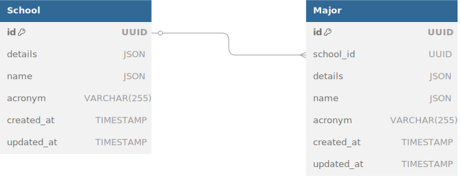

# 📘 UNDERSTANDING.md

## 🧩 Break Down the Problem Statement
จากที่โจทย์กำหนดให้ ปัญหาของมันคือ เราต้องออกแบบ โดย มี DATA Table 2 ตัว (Schools , Major ) ซึ่งปัญหาคือ
- การเชื่อมต่อข้อมูลยังไงให้มีความ รวดเร็วในการทำงาน นอกจากนั้นแล้ว 
- เรายังต้องออกแบบ API ให้ใช้งานง่าย 
- ต้องมีการกัน Error อย่างมีประสิทธิ์ภาพ
- ยังมี Bonus ให้เราทำ API ที่มีฟังช์ชั้น Search ในระบบหลังบ้านอีก

## 🗃️ Database Structure
    

### 🔍 คำอธิบายเพิ่มเติม

ผมคิดว่าโครงสร้าง DATABASE ที่ให้มาก็ดีอยู่แล้ว แต่ติดปัญหาอยู่ที่ว่า ยังไม่ระเอียดพอผมเลย จะมาเขียนเพิ่ม

### 📌 โครงสร้างของ JSON Field

- **name (JSON):**  `{ "eng": "...", "thai": "..." }`
- **details (JSON):**  `{ "description": "...", "phoneNumber": "...", "email": "..." }`

## 📡 API Endpoint Design

### 🏫 School Functions

| Method | Endpoint           | Description                                  |
|--------|--------------------|----------------------------------------------|
| GET    | `/school`          | ดึงข้อมูลโรงเรียนทั้งหมด                   |
| GET    | `/school/{id}`     | ดูรายละเอียดโรงเรียนตาม `id`               |
| GET    | `/school/search`   | ค้นหาโรงเรียนด้วย `name` หรือ `acronym`   |
| POST   | `/school`          | เพิ่มโรงเรียนใหม่                          |
| PUT    | `/school/{id}`     | อัปเดตข้อมูลโรงเรียน                        |
| DELETE | `/school/{id}`     | ลบโรงเรียนแบบ Soft Delete                   |

### 🎓 Major Functions

| Method | Endpoint           | Description                                  |
|--------|--------------------|----------------------------------------------|
| GET    | `/major`           | ดึงข้อมูลสาขาทั้งหมด                       |
| GET    | `/major/{id}`      | ดูรายละเอียดสาขาตาม `id`                   |
| GET    | `/major/search`    | ค้นหาสาขาด้วย `name` หรือ `acronym`       |
| POST   | `/major`           | เพิ่มสาขาใหม่                              |
| PUT    | `/major/{id}`      | อัปเดตข้อมูลสาขา                            |
| DELETE | `/major/{id}`      | ลบสาขาแบบ Soft Delete                       |

## 🧠 Development Decision

- ✅ **Framework:**  ผมใช้ Spring Boot เพราะว่า ผมรู้สึกว่ามันเขียนงาน เข้าใจง่ายกว่า มีการ จัด REST API ได้ดี ดูง่าย แถมยังมีฟังช์ชั่นที่หลากหลาย และ นอกจากนั้น ผมมีประสบการณ์กับ Spring Boot มาก่อน

- ✅ **Database:** ผมใช้ PostgreSQL เพราะว่า มันใช้งานกับ Spring boot ได้ดี ใน Spring boot เข้ามี dependency พร้อมใช้กับ spring boot ได้เลย นอกจากนั้น PostgreSQL ใช้งานง่ายครับ เข้าใจง่าย ด้วยความที่เป็น SQL เลยใช้เหมาะ Relational Database เหตุผลจริงๆ โจทย์บังคับใช้ครับ =-=
